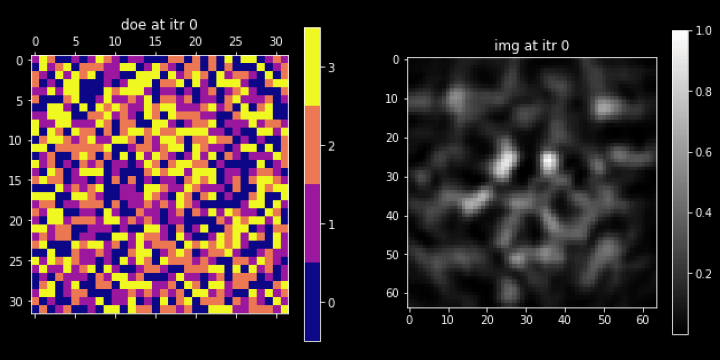
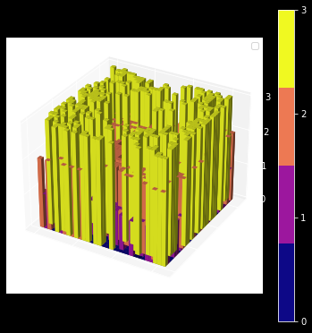

# Differentiable-design-of-discrete-optics-with-gumbel-softmax-trick
Very simple Pytorch implementation of gumbel-softmax trick for differentiable design of discrete optics
- such as the example of **designing multi-level doe for hologram generation** shown here.

## How to start:
**Just run main.py**

## Example:
Optimize a size of $32\times32$ multilevel ($4$) diffraction optical lements (DOE) to render the img on the right.

Final doe profile in 3D is: 

