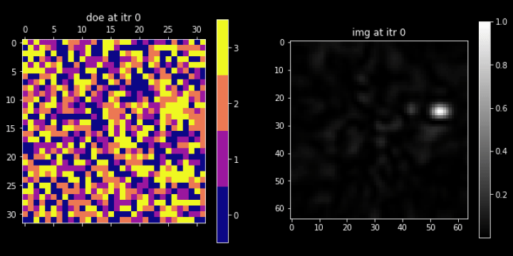

# Differentiable-design-of-discrete-optics-with-gumbel-softmax-trick

> INTRO: in many tasks in computational optics, such as designing imaging lens, holographic optical elements, and inverse lithography, the mask to optimize is discrete sometimes. Thus, we need to design algo to back-prop through the discrete variables. 
> 
Very simple Pytorch implementation of gumbel-softmax trick for differentiable design of discrete optics
- such as the example of **designing multi-level doe for hologram generation** shown below.

Credit to [Cheng Zheng @ MIT](https://github.com/zcshinee) debugs and makes the DOE with gumbel-softmax module work. 
## How to start:
**Just run main.py**

)

## Example:
- Optimize a size of $M \in \mathcal{Z}_4^{32\times32}$ ($4$) multilevel diffraction optical elements (DOE) to render the img on the right.

- Mathematically, the forward process is:
$I_{pred} = |f_{light}(M)|^2$
and:
loss: $|I_{pred} - I_{target}|^2$.

**Final doe profile in 3D is:** 


## Cite it:
The module here was developed as a part for our project and paper [Neural Lithography](https://neural-litho.github.io/).
If you find our code or any of our materials useful, please cite our work:

```bibtex
@article{zheng2023neural,
            title={Neural Lithography: Close the Design-to-Manufacturing Gap in Computational Optics with a'Real2Sim'Learned Photolithography Simulator},
            author={Zheng, Cheng and Zhao, Guangyuan and So, Peter TC},
            journal={arXiv preprint arXiv:2309.17343},
            year={2023}
            }
```


```bibtex
@inproceedings{zheng2023close,
            title={Close the Design-to-Manufacturing Gap in Computational Optics with a'Real2Sim'Learned Two-Photon Neural Lithography Simulator},
            author={Zheng, Cheng and Zhao, Guangyuan and So, Peter},
            booktitle={SIGGRAPH Asia 2023 Conference Papers},
            pages={1--9},
            year={2023}
}
```


